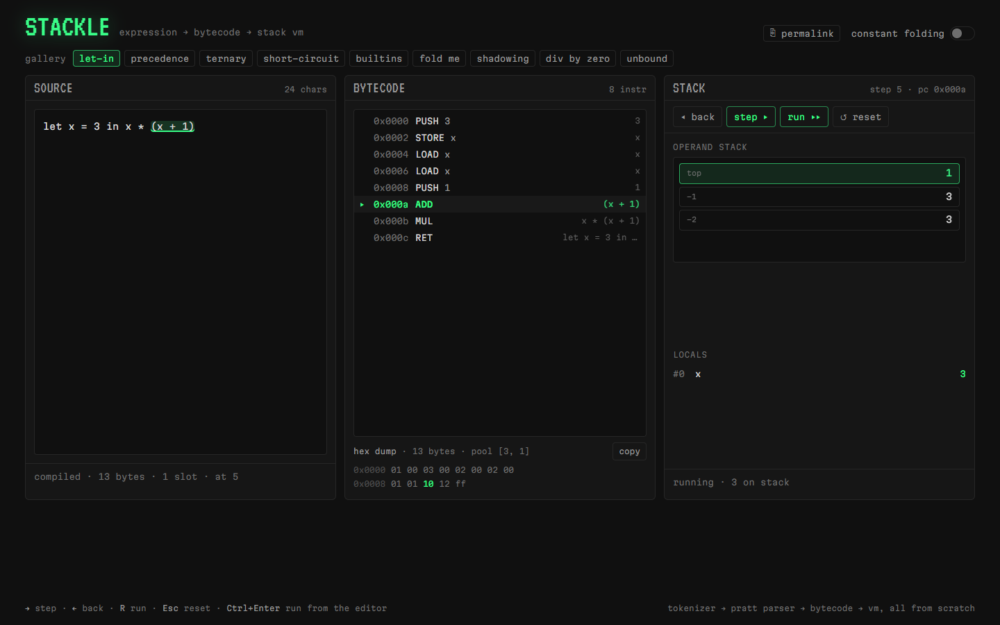

# Stackle

An expression language compiled to bytecode for a tiny stack VM, with side-by-side
source, disassembly, and a step debugger showing the operand stack.



Type `let x = 3 in x * (x + 1)` and the disassembly updates as you type. Press
**Step** and the highlighted instruction advances while values drop onto the
operand stack. Everything (tokenizer, Pratt parser, code generator, optimizer,
VM) is written from scratch in about 900 lines of TypeScript with no runtime
dependencies beyond React.

## Features

- **Pratt parser** for `+ - * / % ^`, unary `-` and `!`, comparisons, `&& ||`,
  ternary `?:`, `let x = e in body`, and calls to `min max abs sqrt`.
- **Bytecode compiler** emitting into a `Uint8Array` with a constant pool:
  `PUSH LOAD STORE POP DUP ADD SUB MUL DIV MOD POW NEG NOT EQ NE LT LE GT GE JMP JZ JNZ CALL RET`.
  Jump targets for ternaries and short-circuit operators are backpatched.
- **Disassembler** showing address, mnemonic, resolved operand (`PUSH 3`,
  `LOAD x`, `JZ 0x000a`, `CALL min/2`) and the source span each instruction
  came from. Hover a row to see its span in the editor.
- **Step debugger**: step / back / run / reset (also `→ ← R Esc`), current
  instruction highlight, animated operand stack, locals table.
- **Constant folding** toggle with a before/after instruction count diff.
- **Runtime errors** (division by zero, unknown identifier) carry a `line:col`
  and highlight the offending span in the source.
- **Hex dump** of the raw bytes with the active instruction lit up, plus copy.
- **Gallery** of examples including a short-circuit demo where `10 / 0` is
  compiled but never executed.
- **Permalinks**: `?src=…&fold=1&step=5` reproduces a program at a given step.

## How it works

**Front end.** The tokenizer turns the source into tokens that each carry a
`{start, end}` span. The parser is a Pratt (precedence-climbing) parser: every
infix operator has a pair of binding powers, `(left, right)`. Left-associative
operators use `(n, n+1)`; `^` uses `(18, 17)` so its right operand can grab
another `^`; the ternary `?` sits at 2 and `let ... in` is a prefix form whose
body extends as far as possible. Unary minus binds at 15, tighter than `*` but
looser than `^`, so `-2 ^ 2` is `-4`. Parenthesised expressions keep their node
but widen its span to include the parens, which is why a division-by-zero
error in `10 / (5 - 5)` points at `1:6`.

**Code generation.** A single pass walks the AST and appends bytes. `let`
allocates a fresh local slot and pushes a scope onto a scope chain so
`let x = 1 in let x = x + 1 in x` gets two slots; free identifiers are also
given a slot so `LOAD x` compiles and only fails when executed. Control flow is
done by emitting a jump with a zero placeholder and patching the little-endian
u16 target once the destination address is known:

```
let n = 7 in n % 2 == 0 ? n / 2 : 3 * n + 1

0x0000 PUSH 7
0x0002 STORE n
0x0004 LOAD n     ┐
0x0006 PUSH 2     │ condition
0x0008 MOD        │
0x0009 PUSH 0     │
0x000b EQ         ┘
0x000c JZ 0x0017  ── if false, jump to else
0x000f LOAD n     ┐
0x0011 PUSH 2     │ then
0x0013 DIV        ┘
0x0014 JMP 0x001f ── skip else
0x0017 PUSH 3     ┐
0x0019 LOAD n     │
0x001b MUL        │ else
0x001c PUSH 1     │
0x001e ADD        ┘
0x001f RET
```

`a && b` compiles to `a; DUP; JZ end; POP; b; end:` so the left value is kept
when it is falsy and replaced otherwise, and `b` is never evaluated when it
would not matter. The optional folding pass runs before codegen and collapses
any subtree whose leaves are all literals (including calls and ternaries), but
deliberately leaves `x / 0` alone so the runtime error still happens.

**Execution.** The VM is a fetch-decode-execute loop over the byte array with a
`Float64Array` operand stack and a locals array indexed by slot. Every
instruction knows its source span, so faults such as `Unknown identifier 'x'
at 1:9` can be mapped back to the editor. The debugger wraps the VM in a
generator that yields a full snapshot (pc, stack, locals, and a unique id per
pushed value) before the first instruction and after every step; React keys the
stack cells by those ids so only newly pushed values animate in.

## Run it

```sh
npm install
npm run dev      # local dev server
npm run build    # type-check and bundle to dist/
npm test         # vitest
```

Or use the compiler as a library:

```ts
import { compile, run } from './src/lang'

run('1 + 2 * 3 ^ 2')                       // 19
compile('2 * 3 + x').disassemble()         // ['PUSH 2', 'PUSH 3', 'MUL', 'LOAD x', 'ADD', 'RET']
compile('1 + 2 * 3', { fold: true }).hex() // '01 00 ff'
run('10 / (5 - 5)')                        // throws: Division by zero at 1:6
```

## Tech

Vite 8, React 19, TypeScript 6 (strict), Tailwind CSS 4, Vitest 5. Fonts are
VT323 and Martian Mono via `@fontsource`.

## License

MIT, Copyright 2026 Jafn.
